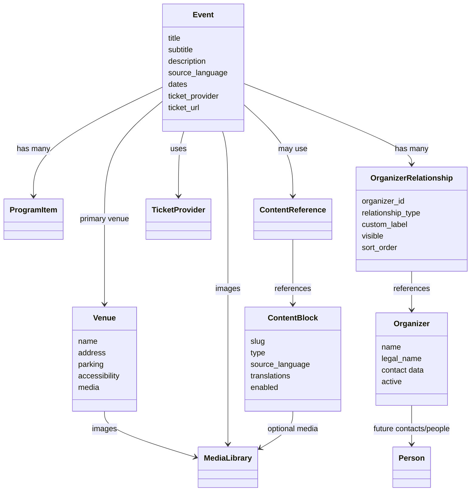
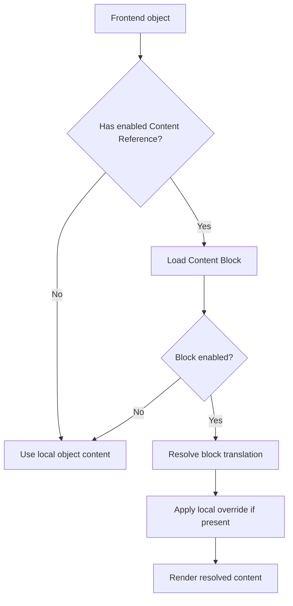
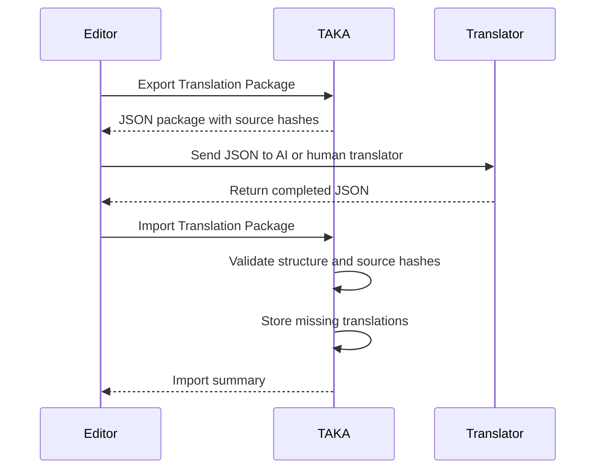
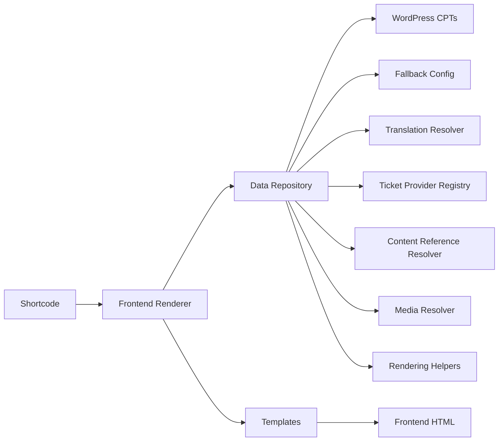

# TAKA Platform Architecture

This document describes the current and planned architecture of TAKA Platform.

It should be read together with `AGENTS.md`, which defines the engineering principles for the repository: platform-first design, configuration over hardcoding, relationships over fixed fields, composition over duplication and backwards compatibility.

## Architectural Goals

TAKA Platform should be:

- modular
- configurable
- multilingual
- white-label capable
- API-oriented
- maintainable
- extensible
- backwards compatible

The current WordPress plugin is the first platform host. The architecture should keep open a path toward richer APIs, frontend editing, external integrations and future plugin extensions.

## Current Module Structure

```text
includes/
  Admin/          WordPress admin screens, CPT registration and save handlers
  Core/           plugin wiring, shortcode registration and asset registration
  Data/           repository and normalization layer
  Frontend/       shortcode renderers and organizer dashboard
  I18n/           static translation loading and manual translation service
  ImportExport/   Translation Package workflow
  Integrations/   export and integration providers
  Rendering/      frontend rendering helpers
  Support/        shared helper functions
  Tickets/        ticket provider interface and registry
templates/        frontend template partials
assets/           frontend/admin CSS and JavaScript
config/           bundled seed/fallback configuration
translations/     static frontend translation JSON files
docs/             focused documentation
```

Legacy `includes/class-taka-tour-*.php` files are compatibility shims. They should remain until a formal deprecation policy exists.

## Core Domain Model



## Events

Events are the central scheduling object.

Current WordPress representation:

- CPT: `taka_event`
- source data from WordPress posts when available
- fallback seed data from `config/tour-events.php`

Events contain public event copy, dates, program items, venue references, organizer relationships, ticket provider data, media, language metadata and translation data.

The repository normalizes raw WordPress or config data into a frontend-ready event structure.

## Venues

Venues describe places where events happen.

Current WordPress representation:

- CPT: `taka_venue`

Venues include address data, country data, route-map coordinates, parking notes, accessibility notes, website and media.

Future direction:

- support multiple venue roles per event
- support richer location metadata
- support reusable venue information blocks

## Organizers

Organizers describe organizations involved in events.

Current WordPress representation:

- CPT: `taka_organizer`

Organizers include name, legal name, website, logos, emails, contact persons, social links, description and active state.

Events do not duplicate organizer profile data. They reference Organizer CPT entries through event-level organizer relationships.

## People

People are a planned domain concept.

Future uses:

- speakers
- instructors
- staff
- translators
- volunteers
- contact persons

Current contact-person data exists mostly as organizer profile fields. A future People model should avoid duplicating person details across events and organizations.

## Program Items

Program Items describe the schedule within an event.

Current representation:

- stored as normalized event metadata or config arrays
- grouped by date on the frontend
- used for start/end date calculation in exports

Future direction:

- rooms
- tracks
- speaker/instructor relationships
- timetable views
- reusable session metadata

## Content Blocks and Content References

Content Blocks are reusable editorial objects.

Current WordPress representation:

- CPT: `taka_content_block`

Content References point from another object to a Content Block.

Current supported references:

- homepage Content Sections
- Event seminar descriptions

Resolution model:



Future direction:

- organizer profile references
- venue information references
- ticket panel references
- modal references
- local override UI

## Ticket Providers

Ticket providers are abstracted through a provider interface and registry.

Current provider:

- Pretix

Current behavior:

- events store `ticket_provider` and `ticket_shop_url`
- frontend asks the ticket provider registry for widget/direct URLs
- Pretix widget rendering is isolated in ticket templates and scoped CSS

Future providers:

- Eventbrite
- WooCommerce
- TicketTailor
- manual registration
- custom external URLs

## Translation Packages

TAKA Translation Packages are provider-independent JSON packages for dynamic multilingual content.

Current scope includes:

- Content Sections
- Content Blocks
- Booking Information
- Ticket Section settings
- Hero settings
- Events
- Organizers
- Venues
- option list labels

Each translatable item includes:

- stable item ID
- object type
- object ID
- field
- source language
- source text
- source hash
- existing translations
- translation targets

## Translation Workflow



Source language is per object where supported. The frontend fallback model resolves dynamic text through:

1. selected language
2. object source language
3. platform fallback language
4. English
5. first non-empty value

## Media Library

Media handling follows a consistent priority:

1. WordPress attachment ID
2. configured fallback URL
3. bundled config fallback
4. render nothing

Media is currently used by events, organizers, venues, Content Sections and Content Blocks.

Future direction:

- reusable media collections
- media roles
- licensing and credit metadata

## Permissions

Current permission model:

- administrators manage all platform data
- organizer users can be assigned to organizer profiles
- organizer users can access limited dashboard and event editing flows
- admin actions use nonces and capability checks

Organizer relationships are security-relevant because an event can involve several organizers.

Future direction:

- policy layer for object-level permissions
- normalized relationship-aware organizer permissions everywhere
- collaborator roles
- editorial review permissions
- translator permissions

## Frontend Rendering Pipeline



Current public shortcodes include backwards-compatible TAKA Tour names and generic TAKA Platform aliases. All aliases call the same rendering logic.

Templates should stay presentation-focused. Data lookups, translation resolution and provider decisions belong in the repository or service layer. Geometry-heavy presentation decisions, such as automatic route-map label placement, live in focused Rendering helpers so they can be reused and tested without adding layout heuristics to templates.

## Import / Export

Current import/export capabilities:

- bundled trusted PHP config import
- pasted JSON config import
- uploaded JSON config import
- dry-run import
- missing/update/overwrite modes
- PHP and JSON config export
- Translation Package export/import
- Events Manager export profiles

Security rule:

- uploaded imports are data only
- uploaded PHP execution is not allowed

## REST API

Current REST endpoint:

- `/wp-json/taka-platform/v1/events`

This endpoint exposes normalized public event data for integrations.

Future REST direction:

- stable event detail endpoint
- organizer and venue endpoints
- authenticated admin/editor endpoints
- translation status endpoints
- import/export status endpoints

REST payloads should avoid sensitive admin-only data.

## Integrations

Current integration layer:

- Events Manager export integration
- ICS provider
- CSV provider
- JSON provider
- Events Manager compatible CSV provider

The export layer keeps TAKA as the source of truth. Direct destructive sync is intentionally not implemented.

Future direction:

- non-destructive sync providers
- calendar subscriptions
- ticket provider webhooks
- analytics exports
- newsletter integrations

## Future Extension Points

Planned or emerging extension points:

- ticket provider registry
- event export providers
- translation providers
- content renderers
- permission policies
- media collection providers
- REST API controllers
- dashboard modules

Extensions should use stable interfaces and normalized data rather than duplicating template logic.

## Current and Planned Architecture

The current architecture is WordPress-first and shortcode-driven. That is appropriate for the present plugin.

The planned architecture remains WordPress-compatible but moves toward:

- stronger service boundaries
- more reusable domain objects
- richer object relationships
- frontend editing for non-admin users
- stable REST APIs
- safer import/export workflows
- white-label configuration
- optional integration providers

Future concepts in this document are marked as future direction. They should not be treated as implemented until corresponding code and documentation exist.
